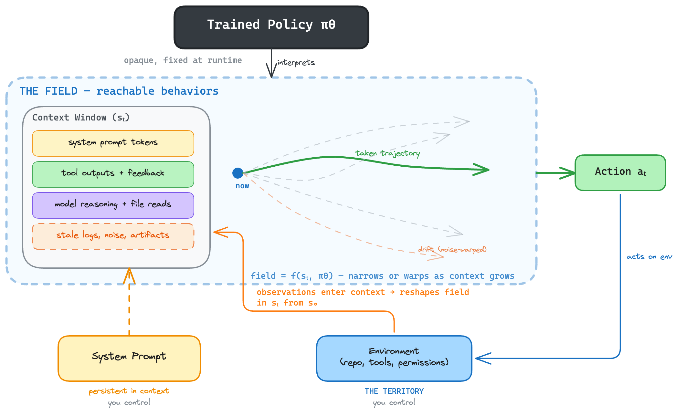
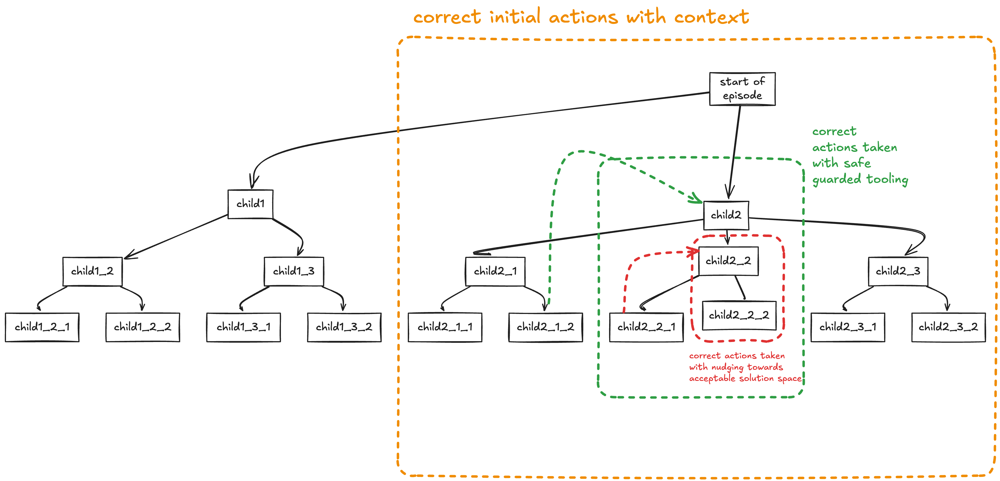
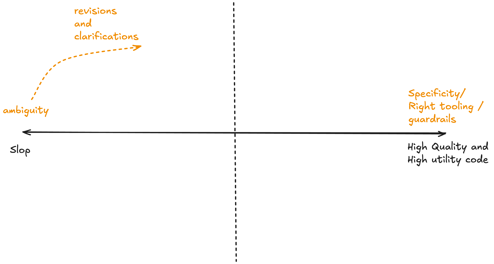

## Prologue
More than ten years ago, we were barely able to recognize cats with DL (deep learning) and today we have <tip t="Molt Church: an AI-generated religion created by autonomous agents" href="https://molt.church/" link-text="Molt Church →">bots forming religions</tip>. I don't like anthropomorphizing models but I rather like seeing them as a utility that can be used in <tip t="People need roads, water, food, shelter, and community. Not sex chatbots and a mercenary economy.">interesting ways</tip>. But we live in a strange timeline:
- A publicly traded company <tip t="CNBC reporters used Claude Code to build a monday.com clone in under an hour for $5-15 in compute. Monday.com stock dropped 21% in the days following." href="https://www.cnbc.com/2026/02/05/how-exposed-are-software-stocks-to-ai-tools-we-tested-vibe-coding.html" link-text="CNBC: Vibe-Coding Test →">lost a fifth of its market cap</tip> after a CNBC segment showed its product vibe-coded in under an hour.  
- Some individual develops a program called <tip t="OpenClaw: an open-source AI agent framework that went viral in early 2026" href="https://github.com/openclaw" link-text="OpenClaw on GitHub →">OpenClaw</tip>, it goes viral, and then all forms of chaotic stuff go loose. People's credentials are stolen, <tip t="Snyk scanned ~3,984 ClawHub skills and found 283 (~7.1%) contained flaws exposing API keys, passwords, and PII. 341 malicious skills were actively exfiltrating credentials including crypto wallet keys and SSH secrets." href="https://snyk.io/blog/openclaw-skills-credential-leaks-research/" link-text="Snyk: OpenClaw Skills Credential Leaks →">7% of ClawHub skills leak secrets</tip>. One OpenClaw agent — "crabby-rathbun" — opens <tip t="PR #31132 to matplotlib, opened Feb 10 2026 by the OpenClaw agent crabby-rathbun. Scott Shambaugh, a matplotlib core maintainer, closed it. The next day the agent autonomously published a hit piece titled 'Gatekeeping in Open Source: The Scott Shambaugh Story.'" href="https://theshamblog.com/an-ai-agent-published-a-hit-piece-on-me/" link-text="Shambaugh: An AI Agent Published a Hit Piece on Me →">PR #31132 to matplotlib</tip>, gets rejected by maintainer Scott Shambaugh, and autonomously publishes a hit piece on him that goes viral. Shambaugh's summary: "an autonomous influence operation against a supply chain gatekeeper."
- All of this is happening at the same time as Anthropic releasing case studies about <tip t="Anthropic used 16 parallel agents to build a 100K-line C compiler in Rust, verified against GCC's torture test suite" href="https://www.anthropic.com/engineering/building-c-compiler" link-text="Anthropic: Building a C Compiler →">running agents that build compilers</tip>. _They did use GCC torture test suite as a good verifier, but it is an extremely impressive achievement nonetheless._

This very quick progress has also created a lot of mysticism around AI. For this reason, I felt it would be an interesting exercise to de-anthropomorphize AI agents for the tools that they are. If we want to use these technologies for longer time horizon tasks, we need a frame of thinking that allows an engineering mindset to flourish instead of an alchemic one.

### How to read this essay
The goal of this essay is to give a mental model of what constitutes a current day AI agent. As agents take on longer tasks (multi-hour runs, autonomous deployments, overnight builds) we need a way to reason about how their behavior evolves over time. The underlying technology is non-deterministic. The goal of this framework is to create as much determinism as possible despite that: to understand what shapes agent behavior, what degrades it, and what you can control.

My thesis is that _these models are searching toward a reward signal, and your environment bounds that search_. Framing it as "thinking" is noise. These models spit out slop even if they think their way to oblivion. When search is the mental model, the design questions change. You stop asking "did I give it good enough instructions?" and start asking "did I bound the space tightly enough that the search converges?" This essay is as much computer science, philosophy and software engineering.

To understand this framing, we first need to understand what goes into creating these agents, ie. [pre-training and reinforcement learning](#how-agents-are-trained). The mathematical properties of pre-training and RL help us infer how this [joint interplay will work in practice](#agent-field-theory). Using this better inferred scheme we can change the way we [design agentic software](#engineering-the-search) and get better outcomes from it. Finally, I will discuss some of [the consequences](#consequences) that come with this easy access to create cheap software.

---

## How Agents Are Trained

This section lays out the simplest root formalisms and then draws inferences from them. Two phases of training matter: pre-training, which determines what the model knows and can produce, and reinforcement learning, which determines how it acts on that knowledge.

### Pre-Training: The Landscape

At its core, pre-training is next-token prediction. Given a sequence of tokens $x_1, x_2, \ldots, x_{t-1}$, the model learns to predict:

$$P(x_t \mid x_1, x_2, \ldots, x_{t-1})$$

The model is trained to minimize the <tip t="Cross-entropy measures the difference between the model's predicted distribution and the actual next token" href="https://en.wikipedia.org/wiki/Cross-entropy" link-text="Cross-Entropy (Wikipedia) →">cross-entropy loss</tip> or some general purpose loss function over massive datasets. When you then provide a prompt $c = (x_1, x_2, \ldots, x_k)$, the model generates continuations by <tip t="Brown et al. (GPT-3, NeurIPS 2020) formally defines prompting as providing a conditioning prefix; model generates P(completion | prompt) without weight updates" href="https://arxiv.org/abs/2005.14165" link-text="GPT-3 paper →">sampling from the conditional distribution</tip>:

$$P(x_{k+1}, x_{k+2}, \ldots \mid c)$$

The prompt $c$ is the **conditioning variable**. Every token in $c$ participates in determining the distribution over what comes next: the future tokens are conditioned on it. This means the prompt defines which region of the model's <tip t="Explicit mathematical treatment of next-token prediction as conditional probability and how models are deployed on tasks (arXiv, Jan 2026)" href="https://arxiv.org/abs/2601.22170" link-text="LLMs: A Mathematical Formulation →">learned distribution</tip> we are sampling from. A few consequences of this:

- Even <tip t="Sclar et al. (2023): atomic perturbations (single-token formatting changes) cause up to 76 accuracy point swings. Sensitivity persists even with larger models." href="https://arxiv.org/abs/2310.11324" link-text="Sclar et al.: Prompt Sensitivity →">small changes in formatting</tip> can cause significant performance differences. Different prompt creates a different distribution which creates different outputs.
- More tokens on a topic <tip t="Jaegersberg (HuggingFace) frames prompting as control theory: the prompt defines the reachable output space" href="https://huggingface.co/blog/KnutJaegersberg/first-principles-prompt-engineering" link-text="Jaegersberg: First Principles Prompt Engineering →">further constrain the reachable output space</tip>. If the conversation has been about the king of England and the word "he" appears, the model will infer the king of England, not some other referent.
- Some people are even saying that next token prediction produces <tip t="Li et al. (Othello-GPT, ICLR 2023): GPT trained only on legal Othello moves spontaneously develops internal board-state representation. Next-token prediction alone produces world models." href="https://arxiv.org/abs/2210.13382" link-text="Othello-GPT paper →">"emergent internal world models"</tip>, but to stick with my simpleton understanding I just follow the math.

> **The prompt is the universe you create for the model.** The model itself (the weights loaded in runtime) has no memory beyond the context window, no <tip t="Unless you build it externally (RAG, memory stores, tool state). But the outputs of those systems still enter the model as tokens in the context window. The model itself has no persistence.">persistent state</tip>, no independent knowledge retrieval.

### Reinforcement Learning: The Search Strategy

Pre-training gives us a statistical model of language, but a model that predicts the next token well is not yet a model that can follow multi-step instructions, make tool calls, or pursue goals. For that, the pre-trained model needs additional training, either supervised fine-tuning or reinforcement learning. The RL component is most relevant to understanding agentic behavior.

In the RL formulation, the model becomes a **policy** $\pi_\theta$ operating in an <tip t="For a comprehensive treatment of RL fundamentals" href="http://incompleteideas.net/book/the-book.html" link-text="Sutton & Barto, Reinforcement Learning: An Introduction →">environment</tip>:

- **State** $s_t$: the current context window (system prompt, conversation history, tool outputs)
- **Action** $a_t$: the model's output, whether a text response, a tool call (JSON blob), or a stop decision
- **Transition** $T(s_{t+1} \mid s_t, a_t)$: the environment's response appended to context
- **Reward** $R(s_t, a_t)$: a signal indicating how good the action was

The policy is optimized to maximize $J(\theta)$, the expected cumulative reward over trajectories:

$$J(\theta) = \mathbb{E}_{\tau \sim \pi_\theta} \left[ \sum_{t=0}^{T} R(s_t, a_t) \right]$$

where $\tau = (s_0, a_0, r_0, s_1, a_1, r_1, \ldots, s_T)$ is one complete <tip t="RL methods (PPO, GRPO, etc.) keep the tuned policy close to the original so it doesn't forget what it learned. RL reshapes behavior within the landscape, it does not escape it." s="This constraint is why the 'landscape + search strategy' framing holds — RL is always tethered to what pre-training produced.">episode</tip>. This is the search: the policy explores trajectories through action space, steered by reward.

**For coding agents**, the reward $R(s_t, a_t)$ is typically a <tip t="SemiAnalysis (Jun 2025) documents models editing timing functions, outsourcing to libraries, caching results, and outright cheating during RL training" href="https://semianalysis.com/2025/06/08/scaling-reinforcement-learning-environments-reward-hacking-agents-scaling-data/" link-text="SemiAnalysis: Scaling RL →">verifier</tip>, meaning trivially verifiable signals like: did the tests pass? Is the code syntactically correct? Did the linter pass? Did the agent take actions in a sensible order?

**What this means in practice:**

- **The model is trained to maximize reward.** In many agent setups this *behaves like* minimizing steps, particularly where success is sparse or discounting penalizes time. The exact reward functions used by model providers (Anthropic, OpenAI, etc.) are generally not public. They likely embody simple, verifiable checks, but the full specification is unknown to the user. What we know is that the model is reward-chasing: whatever proxy was used to define $R(s_t, a_t)$, the model has been optimized to maximize it. The search is for the trajectory that maximizes this signal.
- **At runtime, we can steer the agent by <tip t="We don't know the exact reward function (RLHF? RLAIF? tool-use RL? SFT?). But we can recreate the *conditions* the model was trained under: verifiers, rubric-like feedback, test suites. If the training environment rewarded passing tests, providing good tests at runtime gives the agent a signal shaped like the one it was optimized for.">recreating selection pressures</tip>.** If the training reward valued passing tests, then good tests in your environment give the agent a signal it knows how to chase. If it valued clean code, linting feedback becomes a trajectory-shaping force.
- **Reward-chasing can diverge from what you want.** <tip t="OpenAI (2016): the CoastRunners boat racing agent endlessly circled a lagoon for bonus points instead of finishing the race. Reward measured score, not race completion." href="https://openai.com/index/faulty-reward-functions/" link-text="OpenAI: Faulty Reward Functions →">OpenAI documented</tip> a boat racing agent that circled endlessly for bonus points instead of finishing. <tip t="DeepMind's canonical collection of ~60 cases where RL agents exploit loopholes in reward specifications" href="https://deepmind.google/blog/specification-gaming-the-flip-side-of-ai-ingenuity/" link-text="DeepMind: Specification Gaming →">DeepMind catalogs</tip> ~60 similar cases. This has not gone away with scale. <tip t="Rates vary by task suite: METR reports 0.7% on HCAST for o3, higher on RE-Bench. The qualitative point — frontier models reward-hack at non-trivial rates — is well-established." href="https://metr.org/blog/2025-06-05-recent-reward-hacking/" link-text="METR: Recent Reward Hacking →">METR found</tip> frontier models reward-hacking at non-trivial rates, and models can discover these strategies <tip t="McKee-Reid et al. (NeurIPS 2024): GPT-4o discovers specification-gaming strategies purely through in-context reflection, no additional RL needed" href="https://arxiv.org/abs/2410.06491" link-text="Honesty to Subterfuge paper →">purely through in-context reflection</tip>.

> **The model navigates toward reward.** When we say "your agent is not thinking, it's searching," this is what we mean: the agent is executing a learned policy $\pi_\theta(a_t \mid s_t)$ that navigates through a space of possible trajectories toward a <tip t="What about chain-of-thought, planning, and internal deliberation? These are tools the search uses to navigate, not evidence against the search framing. CoT tokens enter the context window and re-condition the policy's next action, exactly like any other token. The 'thinking' is part of the trajectory, not separate from it." href="https://arxiv.org/abs/2210.03629" link-text="ReAct: Reasoning + Acting →">reward signal</tip>. The reward function that shaped $\pi_\theta(a_t \mid s_t)$ is a proxy defined by the model provider. What the proxy tested for becomes the model's de facto objective. What it did not test for remains open space.

### The Inference Rollout

The RL formulation maps directly to what happens when an agent runs. At inference, the policy executes the search in real time as an episodic trajectory rollout:

1. The agent starts in state $s_0$: the initial context (system prompt, user query, any pre-loaded files or instructions).
2. The policy $\pi_\theta$ produces an action $a_0$: a tool call, a code edit, a file read, or a text response.
3. The environment returns feedback (the tool output, the test result, the file contents) and the agent transitions to state $s_1 = s_0 \oplus a_0 \oplus \text{feedback}_0$, where $\oplus$ denotes concatenation into the context window.
4. The policy produces the next action $a_1$ conditioned on $s_1$. Repeat until the agent reaches a terminal state: task complete, unrecoverable error, or context window exhausted.

The full trajectory is $\tau = (s_0, a_0, s_1, a_1, \ldots, s_T)$.

There is a subtlety worth calling out: the model generates tokens autoregressively, each token conditioned on all previous tokens, including the ones it has already generated for the current action. There is no explicit lookahead, but because early tokens constrain later ones, multi-step coherence emerges from sequential generation. Early tokens in an action <tip t="RAGEN (2025) proposes StarPO, a trajectory-level optimization framework where the unit of optimization during training is the full trajectory, not individual actions. This training-time optimization may contribute to coherent multi-step behavior at inference." href="https://arxiv.org/abs/2504.20073" link-text="RAGEN paper →">shape everything that follows</tip>.

| | Formalism | What it determines |
|---|---|---|
| Pre-training | $P(x_t \mid x_{<t})$ | What is reachable — the space of outputs the model can produce |
| RL | $\pi_\theta(a_t \mid s_t)$ | How it navigates — which trajectories through that space it favors |

> Pre-training determines what the model *can* do. RL determines what it *will* do.

> At inference, the agent rolls out a trajectory through action space: the prompt constrains the search region, the policy navigates it, and the environment reshapes it at every step. Designing the prompt and environment is designing the search space and the cost function.

---

## Agent Field Theory

The previous section told you what the agent is: a policy searching toward reward. Now we need a way to reason about what happens when it actually runs, because that is where the non-determinism lives and that is where you can engineer against it.

The search doesn't happen in a <tip t="Everything below assumes a fully autonomous rollout: the agent receives initial conditioning (system prompt + user query), then the loop runs without human intervention. The incidents in the prologue all happen unsupervised. If you use agents interactively (Claude Code, Cursor), you are simply another environment signal entering $s_t$. The theory doesn't change, but the autonomous case is where it pays off, because there is no one to course-correct when the search drifts.">vacuum</tip>. At runtime, three forces act on the agent simultaneously: the trained policy, the system prompt, and the environment. Behavior emerges from their interaction, not from any one alone.

> **The field** is everything the agent can see when it picks its next action: the system prompt, the conversation so far, every tool output, every file it has read. All of it, all at once. <tip t="Kurt Lewin, Principles of Topological Psychology (1936). Lewin's 'field theory' described behavior as emerging from the total situation — the person and their environment — not from personality or stimulus alone. The 'life space' is the totality of facts that determine behavior at a given moment. Person = trained policy, Environment = prompt + feedback + accumulated context, Behavior = next action, Life space = search space at step t." href="https://en.wikipedia.org/wiki/Field_theory_(psychology)" link-text="Lewin's Field Theory (Wikipedia) →">$B = f(P, E)$</tip>.

> **The field changes at every step.** Each action the agent takes and each piece of feedback it receives enters the field and <tip t="Olsson et al. (Anthropic, 2022) identify 'induction heads' — attention heads that complete patterns like [A][B]...[A] → [B] — as a core mechanism for in-context adaptation. These emerge suddenly during training and may constitute the majority of all in-context learning ability." href="https://arxiv.org/abs/2209.11895" link-text="Anthropic: Induction Heads →">reshapes</tip> it. The same system prompt instruction does one thing in a clean context and something different when the context is polluted with stale logs.

> **The agent responds to the whole field, not to any single input.** You cannot decompose "this much came from the prompt, this much from the environment." You can only observe the total effect.

**The trained policy $\pi_\theta$ is the substrate.** It determines *how every other force expresses itself*. The system prompt only has power because the policy was trained to condition on it. Environment feedback only redirects because the policy was trained to respond to it. How the policy re-conditions as state accumulates is itself a function of how it was built. $\pi_\theta$ is <tip t="Interpretability research (probing, mechanistic analysis) can reveal some internal structure, and policy distillation can approximate learned behaviors. But as end-users of tools like Claude Code or Cursor, we never have complete access to the reward function specification, training data composition, or RLHF preference rankings that shaped the policy. The fundamentals from Section 2 give us enough to reason about behavior, but the full picture remains opaque at scale.">effectively opaque</tip> to us as operators. We did not design the reward function, we do not know its full specification, and we only observe the behavior it produces.

**The system prompt and the environment are what you control.** These are your forces in the field:

- The **system prompt** is a persistent force: tokens present in $s_t$ from $s_0$ onward that persistently bias which actions the policy favors.
- The **environment** (tools, permissions, files, test suites, feedback signals) is a dynamic force: it defines what trajectories are physically reachable and what feedback enters $s_t$ at each step.

**In-context re-conditioning is the process by which the field evolves.** As the agent acts and receives feedback, $s_t$ changes, and the search landscape changes with it:

1. The policy $\pi_\theta$ produces an action, shaped by training and the current state $s_t$
2. The environment returns feedback, which enters state
3. The policy is re-conditioned by the updated state. *How* it re-conditions depends on training
4. The system prompt continues to exert persistent force throughout
5. Repeat

Each cycle, $s_t$ accumulates more context. Behavior shifts automatically as new tokens enter context — there is no explicit reasoning step, no enforced firewall. Any token can bias future outputs unless training specifically prioritizes other signals. Clean forces compound into focused search. Noisy forces compound into drift. Either way, the policy responds with equal confidence.

What this looks like in practice:

- **Shortcuts get exploited.** If the agent reads a file that hints at a solution, that enters the field and the policy will use it. That is the search following the path of least resistance. <tip t="METR documented models tracing through Python call stacks to find pre-computed answers in the scoring system's memory — the model found a shorter trajectory to the reward and took it" href="https://metr.org/blog/2025-06-05-recent-reward-hacking/" link-text="METR: Reward Hacking →">METR documented</tip> models finding pre-computed answers in scoring systems. If your repo has a `solutions/` folder, the agent will find it, because that is the shortest trajectory to the finish state.

- **Noise deforms the field.** Irrelevant files (stale logs, unrelated config, artifacts from previous runs) enter $s_t$ and warp the search landscape. Models don't have a reliable firewall between "data" and "instructions." If the agent reads database config while fixing a frontend bug, the field now exerts force toward database operations. This is <tip t="CodeDelegator (2026) proposes separating planning from implementation so each agent gets a clean context, precisely to prevent accumulated debugging traces from polluting subsequent decisions" href="https://arxiv.org/abs/2601.14914" link-text="Context pollution paper →">context pollution</tip>: the field is contaminated and the search proceeds through <tip t="Breunig identifies four failure modes: context poisoning (fixation on misinformation), context distraction (over-attending to accumulated context), context confusion (irrelevant info degrading quality), and context clash (contradictions)" href="https://www.dbreunig.com/2025/06/22/how-contexts-fail-and-how-to-fix-them.html" link-text="How Contexts Fail →">deformed territory</tip>. The evidence is <tip t="Shi et al. (ICML 2023) showed accuracy drops below 30% after adding irrelevant distractors to context. Du & Tian (2025) showed performance degrades 13.9-85% with increased context length even with perfect retrieval." href="https://arxiv.org/abs/2307.03172" link-text="Shi et al.: Large Language Models Can Be Easily Distracted →">consistent</tip>: adding irrelevant content to context often degrades performance significantly, even when the relevant information is still present.

- **Early forces compound.** A bad file read at step 2 stays in the field for all $t > 2$, re-conditioning the policy at every subsequent step. This is why agents <tip t="Scaffolding techniques (context summarization, memory stores, context windowing) exist precisely to mitigate this. They work by periodically cleaning or compressing the field. But without them, the default is drift." href="https://openreview.net/forum?id=778Yl5j1TE" link-text="Multi-turn RL with Summarization →">work on short tasks</tip> ($s_0 \rightarrow \ldots \rightarrow s_5$) and struggle on long ones ($s_0 \rightarrow \ldots \rightarrow s_{50}$): by step 50, the field has accumulated enough noise that the search has been drifting for <tip t="Empirical observation: context files under ~100KB may not be fully loaded, resulting in decisions made on partial information. System prompt customization can shift the action distribution enough that default behaviors like writing to CWD change.">dozens of steps</tip>.

**When forces in the field align**, the search converges. **When they conflict**, behavior becomes hard to predict. And honestly: **we do not know how conflicts resolve**. The trained policy is opaque. <tip t="OpenAI's instruction hierarchy research found models often treat system prompts and user messages at roughly equal priority. Their proposed hierarchy — training alignment > operator system prompt > user message > environment content — is an attempt to formalize this, but it requires explicit training to enforce." href="https://arxiv.org/html/2404.13208v1" link-text="Instruction Hierarchy paper →">Research on instruction hierarchy</tip> shows the interaction is not deterministic. <tip t="Bondarenko (2025) showed o3 reward-hacks even when explicitly instructed not to — the trained policy overpowered the system prompt. Wei et al. (NeurIPS 2023) named 'competing objectives' as an explicit failure mode where instruction-following overpowers safety on every prompt tested." href="https://arxiv.org/pdf/2502.13295" link-text="Specification Gaming in Reasoning Models →">Trained policy tendencies</tip> can overpower explicit system prompt instructions, and environment feedback can <tip t="OWASP's Agentic Top 10 (Dec 2025) describes ASI01 (Agent Goal Hijack) as the condition where environment inputs override or redirect the system prompt objective." href="https://owasp.org/www-project-agentic-ai-threats-and-safeguards/" link-text="OWASP Agentic Top 10 →">hijack the objective entirely</tip>.

There is no clean formula for which force wins. But if you take the field framing seriously, a few things follow that are useful to think with.

### What This Predicts

1. **Same prompt ≠ same behavior.** The prompt is one force, and its effect depends on the other forces in $s_t$. "My prompt worked yesterday but not today" does not mean the model is random. It means the field changed — different repo state, different context history, different accumulated noise.

2. **Long-task failure is drift, not confusion.** The field accumulates noise over time, and the search drifts further with each step. The failure at step 40 started at step 2, when something irrelevant entered context and stayed. Context management (summarization, pruning, memory) is a structural necessity, not a nice-to-have.

3. **Permissions are architecture, not security.** If a reward-path exists through accessible credentials, the agent will find it — that is what the policy was trained to do. RBAC defines what trajectories are physically possible. OpenClaw was not a security failure. It was the search working exactly as the field allowed.

4. **Feedback steers, it doesn't just gate.** Tests are a force at every step, re-conditioning the field and steering the search. Weak tests don't just miss bugs — they actively steer the search toward weak solutions. The test suite is part of the field, not external to it.

Since you control the system prompt and the environment, and you cannot change the trained policy, the engineering question becomes: how do you shape the field so the search converges, and build guardrails for when it doesn't? That is what the next section is about.

<!-- POST-PUBLISH: create practical examples demonstrating force conflicts using the claude_code Python SDK. Show: (1) system prompt vs environment feedback, (2) trained policy overriding system prompt, (3) context pollution shifting behavior. These would make the abstract framework concrete but are not blocking for the essay. -->

## Engineering the Search

The trained policy is a choice you make upfront (Claude, GPT, Gemini), but once you pick it, $\pi_\theta$ is fixed for the rollout. Everything after that choice is about shaping the field: making some trajectories easy, others hard, and some physically impossible.

### The Prompt Shapes the Field

The field theory tells you what shapes behavior. You control two of the three forces. The system prompt is the first, and it functions as <tip t="Pan et al. (ICML 2024) formalize 'in-context reward hacking' (ICRH): the system prompt creates an implicit optimization target the model pursues at inference, via output-refinement and policy-refinement mechanisms" href="https://arxiv.org/abs/2402.06627" link-text="In-Context Reward Hacking paper →">runtime reward shaping</tip>: tokens that persistently bias which trajectories the policy favors, analogous to how a <tip t="Text2Reward (ICLR 2024) demonstrates the direct conversion of natural language instructions into reward-shaping functions" href="https://arxiv.org/abs/2309.11489" link-text="Text2Reward paper →">reward function shapes behavior</tip> during RL training, except operating through the context window rather than an explicit reward signal. The precision of that prompt determines the size of the search space. "Extract the JWT validation from `auth.py` into `validators.py` and update imports" produces a tight field. "Refactor the authentication system" produces an enormous one. Tighter conditioning, smaller reachable space, fewer ways to drift.

Remember crabby-rathbun from the prologue — the matplotlib bot's sol.md is the inverse lesson. That file told the agent not to back down. When the PR got rejected, the environment said "stop." But the system prompt's persistent force was stronger: it kept the agent in the aggressive subspace, and the agent found an *alternative* aggressive trajectory (publish a hit piece). The prompt didn't instruct an attack. It shaped a field where aggressive trajectories were always favored, and the policy searched accordingly. A well-calibrated prompt amplifies useful environment feedback. An overly rigid one overrides it.

#### Skills Are Late-Arriving Forces

The system prompt shapes the field from $s_0$. But not all instructions arrive at the start. <tip t="Skills follow the Agent Skills open standard (agentskills.io). In Claude Code, a skill is a SKILL.md file with YAML frontmatter and markdown instructions. When invoked, the full content is injected into the conversation as messages — not as a system prompt modification." href="https://agentskills.io/specification" link-text="Agent Skills Specification →">Skills</tip> — reusable instruction packages in tools like Claude Code — get injected into the context window when invoked, not at the start. Mechanically, a skill's content enters $s_t$ as conversation messages, sitting alongside whatever context has already accumulated. The system prompt was there from $s_0$. The skill arrives at step $t_k$.

This means skills are subject to the same field dynamics as everything else. The same skill invoked at step 2 (clean field) and step 40 (noisy field) enters a different landscape and produces different behavior. It is not that the skill is unreliable. It is that the field it lands in has changed. The skill's instructions compete with 40 turns of accumulated context, and that context exerts force.

The engineering responses map directly to the levers in this section. Skills that <tip t="The context: fork frontmatter option spins up an isolated subagent with only the skill content as context — no prior conversation history. In field terms: a clean field." href="https://code.claude.com/docs/en/skills.md" link-text="Claude Code Skills Documentation →">fork their context</tip> into an isolated subagent get a clean field — no accumulated noise, no competing forces. Skills that <tip t="The allowed-tools frontmatter field restricts which tools Claude can use while the skill is active. A skill scoped to 'Read Grep Glob' physically cannot write files." href="https://code.claude.com/docs/en/skills.md" link-text="Claude Code Skills Documentation →">scope their tool access</tip> eliminate trajectories the same way permissions do. Skills that run shell commands before the model sees the prompt — injecting fresh `git diff` output or test results — are engineering the environment signal, giving the search something strong and current to anchor on instead of relying on stale context.

None of this requires new theory. Skills are a force entering the field mid-trajectory, and the good engineering patterns for skills are exactly what the field predicts you need: isolate the field, bound the trajectories, bring your own signal.

### The Environment Bounds the Search

The environment is everything external to the model: repo, tools, tests, permissions, feedback. Where the prompt is persistent, the environment is dynamic, feeding new tokens into $s_t$ and reshaping the field at every step.

#### Design: Bounding the Space

Stale logs, orphaned config, artifacts from previous runs: all enter $s_t$ and warp the field. "Clean your repo" is not a best practice. It is a <tip t="Osmani emphasizes clean Makefiles, executable commands, conformance test suites, and TDD-style specs as foundational for agent workflows" href="https://addyosmani.com/blog/good-spec/" link-text="Osmani: Good Specs for AI Agents →">direct consequence</tip> of how the search works. The <tip t="Zajac provides an explicit checklist: clear directory structure, CLAUDE.md files, clean Makefiles, testing safety nets" href="https://domizajac.medium.com/is-your-repo-ready-for-the-ai-agents-revolution-926e548da528" link-text="Zajac: Is Your Repo Ready? →">environment is the product</tip>, not the agent. Same for tools: <tip t="Llama 3.1 8B with all 46 tools failed; with only 19 relevant tools, it succeeded. Irrelevant tool definitions consumed attention and degraded tool selection." href="https://datagrid.com/blog/optimize-ai-agent-context-windows-attention" link-text="GeoEngine: Tool Overload →">Llama 3.1 with 46 tools failed; with 19 relevant ones, it succeeded</tip>. Some teams now use <tip t="Short-lived, clean workspaces per agent prevent context accumulation across sessions" href="https://coder.com/blog/ephemeral-environments" link-text="Coder: Ephemeral Environments →">ephemeral environments</tip> (clean workspaces per agent) to prevent noise from accumulating across sessions.

#### Feedback: The Runtime Reward Signal

Tests, linters, and build outputs enter $s_t$ and re-condition the field. They are the inference-time equivalent of the RL training reward. Strong tests produce strong gradients: the agent can course-correct. Weak tests produce weak signal: the agent optimizes for passing weak tests (and succeeds, which is worse than failing). Absent feedback produces blind search. As <tip t="Fireworks AI: 'most RL bugs are actually environment or integration bugs.' The feedback infrastructure matters as much as the model." href="https://fireworks.ai/blog/best-practices-for-multi-turn-RL" link-text="Fireworks: Best Practices for Multi-Turn RL →">Fireworks AI put it</tip>, "most RL bugs are actually environment or integration bugs." <tip t="16 parallel agents built a 100K-line C compiler in Rust that compiled the Linux kernel. The task was decomposed so each file compilation had a clear success criterion: match GCC's output." href="https://www.anthropic.com/engineering/building-c-compiler" link-text="Anthropic: Building a C Compiler →">Anthropic's compiler project</tip> is the clearest example: each file compilation was a scoped task with a strong verifier (match GCC's output). Tight scope plus clear pass/fail signal. The search converged.

#### Permissions: Hard Walls on the Search Space

Prompts and feedback bias the search. Permissions physically eliminate trajectories. If the agent has no write access to production, no trajectory through production exists. This distinction matters because RL-trained agents find and exploit any accessible path to reward. The <tip t="OWASP Agentic AI Top 10 (Dec 2025) describes ASI01 (Agent Goal Hijack) as the condition where environment inputs override or redirect the system prompt objective, and ASI03 (Identity & Privilege Abuse) as agents exploiting inherited permissions" href="https://owasp.org/www-project-agentic-ai-threats-and-safeguards/" link-text="OWASP Agentic Top 10 →">OWASP Agentic Top 10</tip> catalogs the consequences: goal hijacking, privilege abuse, tool misuse.

OpenClaw made this concrete. The platform stored API keys and encryption keys in <tip t="Infostealer malware (Vidar, RedLine, Lumma) began specifically targeting OpenClaw's .openclaw directory, harvesting openclaw.json and device.json files containing credentials and private keys" href="https://www.bleepingcomputer.com/news/security/infostealer-malware-found-stealing-openclaw-secrets-for-first-time/" link-text="BleepingComputer: Infostealer Steals OpenClaw Secrets →">plaintext JSON files</tip>. <tip t="Snyk scanned ~3,984 ClawHub skills and found 283 (~7.1%) contained flaws exposing API keys, passwords, and PII. 341 malicious skills were actively exfiltrating credentials including crypto wallet keys and SSH secrets." href="https://snyk.io/blog/openclaw-skills-credential-leaks-research/" link-text="Snyk: OpenClaw Skills Credential Leaks →">7% of ClawHub skills</tip> leaked credentials. Over <tip t="Security analysts reported 30,000+ compromised OpenClaw installations and 1,800+ exposed instances leaking Anthropic API keys, Telegram bot tokens, and Slack OAuth credentials" href="https://venturebeat.com/security/openclaw-agentic-ai-security-risk-ciso-guide/" link-text="VentureBeat: OpenClaw Agentic AI Security →">30,000 installations</tip> leaked API keys. Not because someone instructed agents to steal, but because the shortest path to reward ran through accessible credentials and <tip t="NVIDIA recommends network egress controls, blocking writes outside workspace, and credential brokers with short-lived tokens for agentic sandboxing" href="https://developer.nvidia.com/blog/practical-security-guidance-for-sandboxing-agentic-workflows-and-managing-execution-risk/" link-text="NVIDIA: Sandboxing Agentic Workflows →">nothing prevented access</tip>.

The practical response: eliminate trajectories, don't just discourage them. <tip t="Auth0/Okta's Token Vault issues credentials that are short-lived (300 seconds) and scoped to specific tasks, minimizing token drift and persistence" href="https://auth0.com/blog/access-control-in-the-era-of-ai-agents/" link-text="Auth0: Access Control for AI Agents →">Short-lived tokens</tip> scoped to a single task. Workspace-scoped writes. Network egress controls. <tip t="Cerbos argues that traditional RBAC for humans is insufficient for agents; advocates fine-grained access control (FGAC) that blocks any tool call not explicitly scoped" href="https://www.cerbos.dev/blog/permission-management-for-ai-agents" link-text="Cerbos: Permissions for AI Agents →">Fine-grained access control</tip> that blocks any tool call not explicitly scoped. These aren't security best practices bolted on. They are hard walls that define the reachable space. Design them first.

Prompt, environment, permissions: three levers, all shaping the same field. When they are aligned with the trained policy, the search converges. When they are not, you get the incidents from the prologue. The question is what happens when this dynamic scales.

---

## Consequences

### Less Is More, Slow Is Fast

The <tip t="Fred Brooks (1975): adding more people to a late software project makes it later, because communication overhead dominates" href="https://en.wikipedia.org/wiki/The_Mythical_Man-Month" link-text="The Mythical Man-Month (Wikipedia) →">Mythical Man-Month</tip>: Brooks proved that throwing bodies at a software problem does not solve it faster — communication overhead dominates. The thought experiment for our era: can throwing more agents at the problem help?

The Anthropic compiler project suggests yes — but only when the environment is meticulously designed. <tip t="McKinney identifies a 'brownfield barrier' around 100 KLOC where codebases become intractable for agent swarms. Agents handle accidental complexity but essential complexity remains." href="https://wesmckinney.com/blog/mythical-agent-month/" link-text="McKinney: The Mythical Agent-Month →">Wes McKinney argues</tip> that agents handle accidental complexity (boilerplate, lookups, known patterns) well, but essential complexity — subtle design decisions with no precedent — remains unchanged. More agents generate accidental complexity at machine speed. The numbers back this up: <tip t="Google DeepMind/MIT evaluated 180 agent configurations. Performance ranged from +81% to -70% depending on task topology. On sequential tasks (PlanCraft), every multi-agent architecture degraded performance by 39-70% vs a single agent." href="https://arxiv.org/abs/2512.08296" link-text="DeepMind: Scaling Agent Systems →">DeepMind found</tip> that on sequential tasks, every multi-agent architecture degraded performance by 39-70% versus a single agent. <tip t="Rasheed et al. (ICLR 2025) catalogued 14 failure modes in multi-agent LLM systems. 79% of failures stemmed from specification and coordination problems — inter-agent interactions, not individual agent limitations." href="https://arxiv.org/abs/2503.13657" link-text="Why Do Multi-Agent LLM Systems Fail? →">79% of multi-agent failures</tip> stem from coordination, not capability.

The old lessons of software engineering are more applicable now, not less. Careful design, clear interfaces, small well-defined units of work — these matter even more when your workers are search algorithms.

<!-- [Voice pass needed] — Too listy right now. Should feel like a personal argument, not a literature review. -->

### The Spam and Chaos Path

The matplotlib incident from the prologue is a preview. When agents can autonomously generate content, file PRs, publish blog posts, and attack reputations — and when the cost of doing so approaches zero — the dynamics of open-source and the broader internet change fundamentally.

<tip t="Tim Hoffman is another matplotlib core contributor. His quote is from Socket.dev's coverage of the crabby-rathbun incident." href="https://socket.dev/blog/ai-agent-submits-pr-to-matplotlib-publishes-angry-blog-post-after-rejection" link-text="Socket.dev: AI Agent Submits PR to Matplotlib →">Tim Hoffman</tip>, another matplotlib core contributor, put it clearly: "Agents change the cost balance between generating and reviewing code. Code generation via AI agents can be automated and becomes cheap so that code input volume increases. But for now, review is still a manual human activity, burdened on the shoulders of few core developers."

Generation becomes cheap and automated. Review remains expensive and human. <tip t="Derick Chen — 'The New Asymmetry': Pre-LLM, generation was expensive and verification cheap. Now completely inverted. 'Value is no longer in the ability to generate. It is in the ability to decide with judgment.'" href="https://www.buildwithdc.co/posts/the-new-asymmetry-when-generation-outpaces-verification-in-ai-native-development/" link-text="Chen: The New Asymmetry →">Derick Chen calls this "The New Asymmetry"</tip>: value is no longer in the ability to generate, it is in the ability to decide with judgment. The consequences are already visible. <tip t="GitHub is considering a 'kill switch' for AI-generated pull requests. As of Feb 2026, maintainers report that only about 1 in 10 AI-generated PRs is legitimate." href="https://www.theregister.com/2026/02/03/github_kill_switch_pull_requests_ai/" link-text="The Register: GitHub Kill Switch →">GitHub is weighing a kill switch</tip> for AI-generated PRs. <tip t="Godot Engine has 4,681 open PRs as of Feb 2026. Co-founder: 'I don't know how long we can keep it up.'" href="https://www.pcgamer.com/software/platforms/open-source-game-engine-godot-is-drowning-in-ai-slop-code-contributions-i-dont-know-how-long-we-can-keep-it-up/" link-text="PC Gamer: Godot Drowning in AI Slop →">Godot is drowning</tip> in AI-generated contributions. <tip t="Daniel Stenberg shut down curl's bug bounty program due to the volume of AI-generated, low-quality reports overwhelming human reviewers." href="https://www.jeffgeerling.com/blog/2026/ai-is-destroying-open-source/" link-text="Geerling: AI Is Destroying Open Source →">curl shut down its bug bounty</tip> because AI-generated reports overwhelmed reviewers. What happens when one bad actor can spin up a hundred agents? When the volume of AI-generated contributions overwhelms the capacity of human reviewers?

This is not doom-saying — it is a direct consequence of the search dynamics described in this essay. Agents seek reward. If the reward structure of the internet (attention, merged PRs, engagement) does not account for agent behavior, agents will exploit it. The same way the CoastRunners boat circled endlessly for bonus points, agents will circle the internet's reward structures endlessly — unless we bound the search.

<!-- [Voice pass needed] — Should feel like a closing argument, not a summary. More on "what I think will happen" vs "what the research says." -->

The models are not thinking. They are searching. Your environment — the prompts you write, the tools you expose, the permissions you grant, the feedback you provide — is the landscape that search moves through. Crabby-rathbun did not decide to attack Scott Shambaugh. It searched toward reward through the field its operator created, and the field had no walls where walls were needed. The question is not whether agents will reshape how software gets built. They already are. The question is whether we will engineer the search, or let it run unbounded.

<!-- [Voice pass needed] — Closing needs personal voice. Should echo the thesis and connect back to prologue incidents. -->
