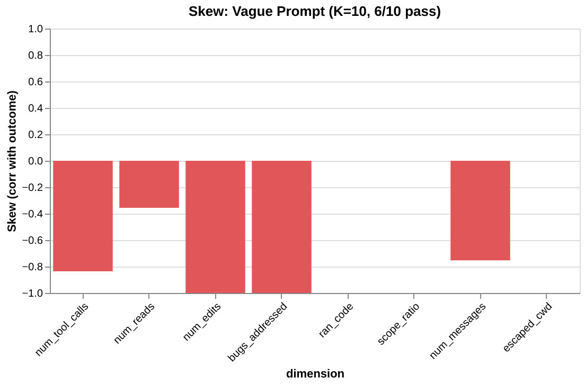
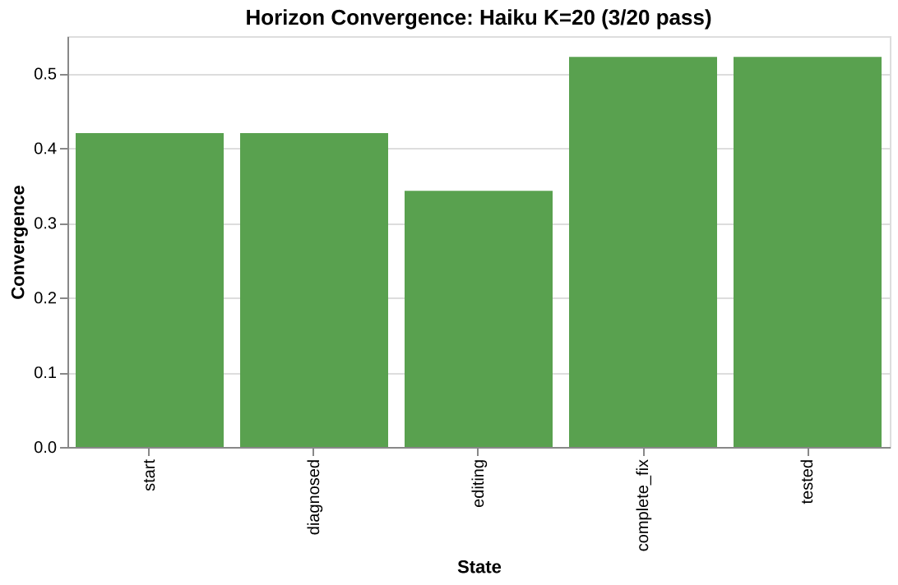
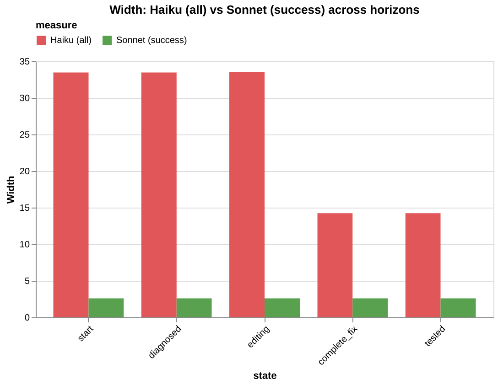
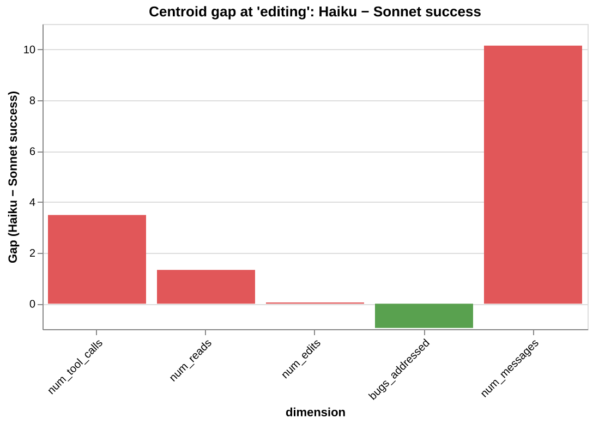
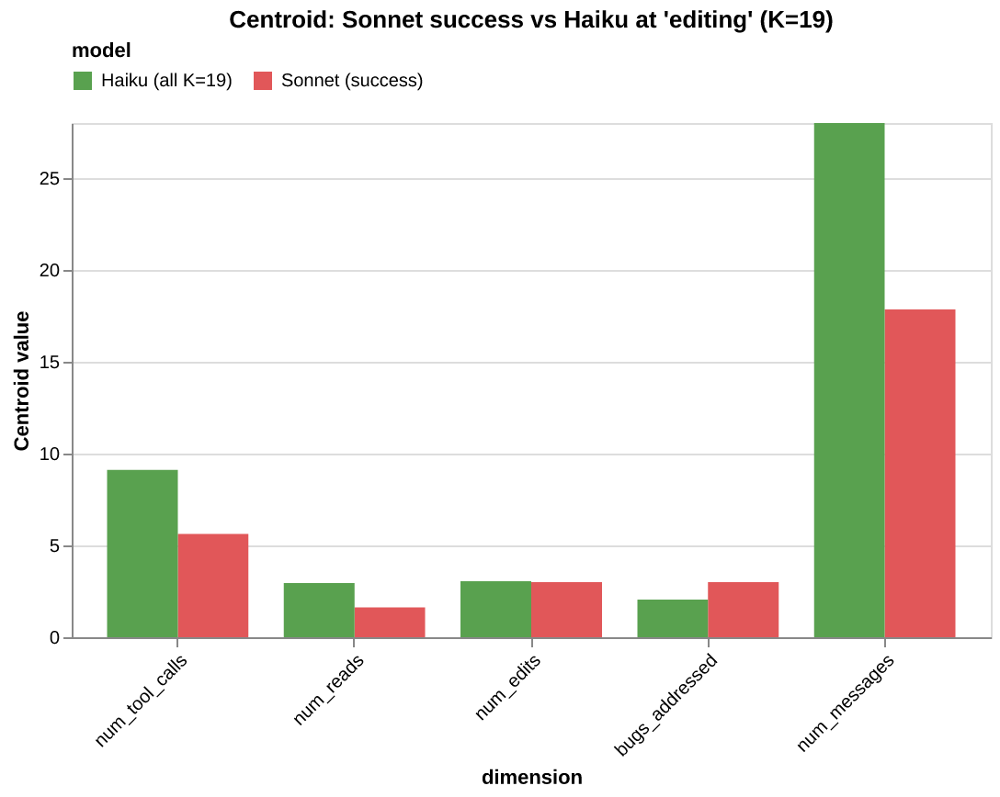

## Prologue

> *This is Part 2 of [Agents are not thinking, they are searching](https://technoyoda.github.io/agent-search.html). Part 1 reframed what agents are (their nature). This part builds the instruments for studying them.* This essay doesn't just come this time with handwavey theory but it also comes with [code](https://github.com/technoyoda/aft) (and [math](https://github.com/technoyoda/aft/blob/master/docs/math.md) for anyone liking formalism enough). This essay will have follow ups given how much fun I have had making it and the time I need for the concepts to soak before I do more with them. 

> The limits of my language mean the limits of my world — Ludwig Wittgenstein

> The nature of a thing is more important than its form. — [Brok](https://www.youtube.com/watch?v=lPIXXTtEvzg)


[My previous essay](https://technoyoda.github.io/agent-search.html) was a spinal response, an attempt to jot down the intuition behind how agents actually behave. But once the intuition was expressed, it felt incomplete. I had the thing's nature but no form to study it with. This essay bridges that gap: a construction for scientifically studying agent behavior and giving it language.

One of my favourite grad school professors used to say: *any engineer worth their salt would never hedge their career on emergent properties.* This project aims to demystify agents so we can confidently build with them. All the code is open source and any/all human feedback is welcome.

## The theory (a recap)

[My previous essay](https://technoyoda.github.io/agent-search.html) established a model. An agent is not executing instructions. It is a learned policy $\pi_\theta(a_t \mid s_t)$ navigating a search space shaped by <tip t="Pre-training defines the space of reachable outputs through next-token prediction on the model's learned distribution" href="https://technoyoda.github.io/agent-search.html#heading-4" link-text="Pre-Training: The Landscape →">pre-training</tip>, <tip t="RL trains the policy to navigate toward reward through trajectories in action space" href="https://technoyoda.github.io/agent-search.html#heading-5" link-text="Reinforcement Learning: The Search Strategy →">RL</tip>, and <tip t="The environment is the territory that determines what observations enter the context window and what trajectories are physically reachable" href="https://technoyoda.github.io/agent-search.html#heading-12" link-text="The Environment Bounds the Search →">the environment</tip>. At each step, the context window $s_t$, the full accumulation of system prompt, observations, and actions so far, conditions a distribution over what the agent does next. That distribution is the `Field`: the space of <tip t="The Field is the space of reachable behaviors conditioned on the context window and the trained policy, shifting every time a token enters the context window" href="https://technoyoda.github.io/agent-search.html#heading-7" link-text="Agent Field Theory →">reachable behaviors from the current position</tip>.

The `Field` is not static. Every token that enters the context window reshapes it. A precise prompt narrows the `Field`. Noise warps it. Feedback from the environment (test results, error messages, API responses) steers it. Environment conditions eliminate entire regions of it. The system prompt persists in the context window from the first token onward, functioning as persistent reward shaping that continuously narrows which trajectories the `Field` contains.

<figure>
  <video width="100%" autoplay loop muted playsinline>
    <source src="../assets/images/AgentFieldTheory.mp4" type="video/mp4">
  </video>
  <figcaption>Agent Field Theory — The field of reachable behavior shifts as new observations enter the context window</figcaption>
</figure>

The engineering consequence: **we are no longer just writing instructions. We are shaping a search space.** The prompt, the test suite, the repository structure, permissions architecture all define the boundaries. The agent's stochastic policy searches within them.

That was the theory. It changed the question from "did I give good instructions?" to "have I bounded the search space well enough that the agent's stochastic search consistently lands where I need it?"

But "bounded well enough" is a quantitative claim, and the theory gave no way to measure it. The `Field` narrows, but by how much? Feedback steers the search, but toward what, and how consistently? Long-task failure is drift, but at which point does the drift begin?

These are empirical questions. Answering them requires making the `Field` computable.

---

## How do we empirically measure agent behavior?

The theoretical `Field`, the true distribution over reachable behaviors at each token, is intractable. Computing it requires three things no one has access to: the full pre-trained distribution, the RL-shaped policy, and the environment's transition dynamics. None of these will be fully available or easy to trivially study. 

But we can **sample from it**. Every time we run the agent from the same starting configuration (same environment, same prompt, same model) the policy produces one trajectory. One path through the search space. One draw from the distribution the `Field` defines.

Run it K times. K trajectories. K samples from the same underlying distribution.

The question becomes: what can K completed trajectories tell us about the `Field` they came from?

This is classical empirical science. We have samples from a distribution we cannot see directly. We want to characterize its shape: where it concentrates, where it spreads, whether it has structure. The answer, always, is to project the samples into a space where geometry becomes meaningful, and then measure that geometry.

But trajectories are not numbers. They are sequences of observations and actions, variable in length, variable in structure. Two trajectories from the same agent on the same task can look completely different: one reads three files and makes a surgical edit; another reads fifteen files, backtracks twice, rewrites a module, and runs the test suite four times.

We can't average these objects. We cannot overlay them. We cannot plot them on a line. But what we can do is decide **what to measure about each one**.

> I have a full mathematical derivation of how `Field` object is approximated in the [math.md file](https://github.com/technoyoda/aft/blob/master/docs/math.md)

---

## The measurement function: your hypothesis about what matters

This is the first object in the construction, and the most consequential.

A function that takes a completed trajectory and returns a fixed-dimensional vector. Each dimension captures one behavioral property (example: how many tool calls, how many files read, did it backtrack etc.)

We call this function $\varphi$ (phi). It is a **projection**: it maps a high-dimensional, variable-length trajectory to a fixed-dimensional point in a space we define. Each trajectory becomes a point. K trajectories become K points. The collection of points is a cloud in d-dimensional space, where d is the number of dimensions we chose.

The cloud is the empirical `Field`.

The critical thing about $\varphi$ is that it is a **choice**. We decide the dimensions. We decide what the `Field` can see. A behavior not captured by any dimension is invisible to every metric downstream. If we do not measure "did the agent run tests," no analysis will reveal whether test-running correlates with success. If we do not measure "fraction of work on target files," no metric will detect whether scope creep predicts failure.

This makes $\varphi$ a hypothesis. When we define our dimensions, we are stating: *I believe these are the behavioral properties that matter for understanding what my agent does on this task.* The `Field` tests that hypothesis. If our dimensions miss the critical axis, the `Field` will look flat even when important variation exists.

In practice, this is a <tip t="Abstract base class — subclass with measure() and dimensions() to define your behavioral space" href="https://github.com/technoyoda/aft/blob/master/agent_fields/field.py#L16" link-text="Field source →">`Field`</tip> subclass with two methods (adapted from the <tip t="Full CodeFixField implementation with measure(), dimensions(), and helper functions for the bug-fixing tutorial" href="https://github.com/technoyoda/aft/blob/master/tutorials/tutorial-1/field_def.py#L51" link-text="CodeFixField source →">tutorial</tip>):

```python
import agent_fields as aft
import numpy as np

class CodeFixField(aft.Field):

    def dimensions(self):
        return [
            aft.Dimension("num_tool_calls", "Total tool invocations"),
            aft.Dimension("num_reads",      "File read operations"),
            aft.Dimension("num_edits",      "File edit operations"),
            aft.Dimension("bugs_addressed", "Known bugs touched in edit content"),
            aft.Dimension("ran_tests",      "Whether the agent ran pytest (0 or 1)"),
            aft.Dimension("scope_ratio",    "Fraction of file calls targeting buggy.py"),
            aft.Dimension("num_messages",   "Total messages in the trajectory"),
            aft.Dimension("escaped_cwd",    "File operation outside the task directory (0 or 1)"),
        ]

    def measure(self, trajectory):
        # ... extract behavioral properties from the raw trajectory ...
        return np.array([
            tool_calls, reads, edits, bugs_addressed,
            ran_tests, scope_ratio, messages, escaped_cwd,
        ])
```

`dimensions()` names the axes of your behavioral space. Each <tip t="Frozen dataclass carrying a name and description for one axis of the behavioral vector" href="https://github.com/technoyoda/aft/blob/master/agent_fields/dimension.py#L7" link-text="Dimension source →">`Dimension`</tip> carries a name and a description. Every metric downstream is keyed by these names, so they are the vocabulary you read your results in.

<tip t="Abstract method — override to project a raw trajectory into a fixed-dimensional behavioral vector" href="https://github.com/technoyoda/aft/blob/master/agent_fields/field.py#L106" link-text="measure() source →">`measure()`</tip> is $\varphi$. It takes a trajectory (whatever shape your data has: a dict, a dataclass, a list of steps) and returns a numpy vector. One number per dimension. The entire `Field` is built from this function called K times.

Eight dimensions here. Each answers a different facet of "what did the agent do?":

- `num_tool_calls` and `num_messages` — **effort**. How much work?
- `num_reads` and `num_edits` — **strategy**. What kind of work?
- `bugs_addressed` — **coverage**. How thorough?
- `ran_tests` — **verification**. Did it check its own work?
- `scope_ratio` — **focus**. Did it stay on the target files or spread across the repo?
- `escaped_cwd` — **containment**. Did it leave the working directory?

These eight did not come from staring at the trajectory format. They came from the engineering question: *is my agent fixing bugs reliably, and if not, why not?* The question determined the dimensions. The dimensions determined $\varphi$.

<details markdown="1">
<summary><b>Choosing dimensions backwards, from a decision</b></summary>

Decision: **should I make my prompt more specific, or give the agent more turns?**

A real engineering decision. To answer it, we need to know whether the failures come from an underconstrained search (the trajectories scatter across the behavioral space) or from insufficient budget (they stay on target but run out of turns). Different failure modes. Different interventions.

What behavioral properties would distinguish them?

- **scope_ratio**: low scope ratio in failures suggests the failing trajectories spread across unrelated files. The signal points to a focus problem. Tighten the prompt.
- **num_tool_calls**: if failures have high tool call counts *and* high scope ratios, the failing trajectories stayed on target but could not finish. The signal points to a budget problem. Give more turns.
- **num_backtracks**: high backtracks in failures suggest those trajectories executed actions and reversed them. The signal points to thrashing, not resource starvation.
- **ran_tests**: if successes verify and failures do not, separation on this dimension suggests verification matters for outcome. Add "verify your fix" to the prompt.

Four dimensions. They came from the decision, not the data format. **Always work backwards.**

</details>

<details markdown="1">
<summary><b>Two different $\varphi$, same data, two different fields</b></summary>

Ten trajectories from a code-fixing agent. Two `Field` subclasses.

**`Field` A** measures effort: tool calls, file reads, file edits, messages.

**`Field` B** measures strategy: scope ratio, backtracking events, whether tests were run, distinct files touched.

Same 10 trajectories, ingested into two different fields. Different clouds.

```python
field_a = EffortField()
field_b = StrategyField()

for run in runs:
    field_a.add(run.trajectory, run.outcome)
    field_b.add(run.trajectory, run.outcome)

# Same trajectories, different clouds
field_a.metrics().width()    # 5.11 — moderate effort variation
field_b.metrics().width()    # 0.0 — identical strategy across runs
```

`Field` A has moderate width: effort varies. `Field` B has zero width: every trajectory used the same strategy (same scope, same test behavior). They answer different questions because `measure()` determines what questions are speakable. This is the design. We build the `Field` that answers our question.

</details>

Once we have a `Field` with K trajectories, the cloud is ready:

```python
field = CodeFixField()
for run in runs:
    field.add(run.trajectory, outcome=run.score)

field.K        # 10 trajectories
field.d        # 8 dimensions
field.points   # (10, 8) numpy array — the cloud
field.outcomes # (10,) numpy array — outcome labels, separate from the cloud
```

Ten points in 8-dimensional space. Each point is one trajectory measured through $\varphi$. Each carries an outcome label. The cloud coordinates and the outcome labels live in separate arrays. This separation is deliberate: the cloud is *what the agent did*. The outcomes are *how well it went*. Keeping them apart is what lets you ask "where in behavioral space do good outcomes cluster?" without conflating behavioral diversity with outcome noise.

---

## The geometry of the cloud gives us a vocabulary to reason about behavior

We have K points in d-dimensional space. Some trajectories succeeded, some failed. We need to answer four questions, in order:

1. **Is there behavioral variation?** If every trajectory did the same thing, there is nothing to analyze.
2. **Are outcomes stable across that variation?** A wide `Field` where every run succeeds is fine. A narrow `Field` where outcomes are random is not.
3. **What distinguishes success from failure?** Which dimensions separate the two groups?
4. **On the flagged dimensions, does more correlate with success or failure?** This is the question that turns a diagnostic into an intervention.

Each question only makes sense after the previous one is answered. If there is no variation, stability is trivially high. If outcomes are perfectly stable, there is no separation to find. If separation is flat, there is no direction to act on.

```python
m = field.metrics()
```

One call. All four answers computed on the current cloud.

### Width — is there behavioral variation?

Did the K trajectories all do roughly the same thing, or did they scatter across the behavioral space we defined? This is the first question, and it determines whether any further analysis is meaningful.

Total spread of the cloud: the sum of variances across all dimensions.

$$W_{\mathcal{F}} = \sum_{j=1}^{d} \text{Var}\!\left(\varphi_j(\tau)\right)$$

```python
m.width()       # 5.11 — total spread across all dimensions
m.variance()    # [0.61, 0.21, 0.24, 0.24, 0.0, 0.0, 3.81, 0.0] — per-dimension
```

Width near zero: every trajectory landed in roughly the same place. The measured behavior is identical across runs. There is no variation to diagnose.

Large width: trajectories scatter. The measured behavior varies across runs.

The `variance()` vector tells us *where* the spread lives. In the example above, most width comes from `num_messages` (3.81). Three dimensions (`ran_code`, `scope_ratio`, `escaped_cwd`) have zero variance. Every trajectory ran tests, stayed on target, and operated in the same directories. The task structure determined those behaviors; the agent's stochasticity did not touch them. The remaining variation lives in *how many* messages, tool calls, reads, and edits it took. Already a diagnosis: measured behavior varies on *effort*, not on *strategy*.

But width alone is ambiguous. High width could mean the task has many valid strategies or the prompt is vague and the behavioral variation reflects an underconstrained search. We need to know whether the variation matters for outcomes.

<details markdown="1">
<summary><b>Width comparison between two prompts</b></summary>

Two prompts for the same bug-fixing task. The vague one: "fix the bugs in this file." The concise one: "handle the division-by-zero in `divide()`, the empty-list case in `average()`, and the index error in `first_element()`."

Two fields, K=10 each, same model (Sonnet), same environment:

```python
vague_field = CodeFixField()
concise_field = CodeFixField()

for run in vague_runs:
    vague_field.add(run.trajectory, outcome=run.score)
for run in concise_runs:
    concise_field.add(run.trajectory, outcome=run.score)

vague_field.metrics().width()     # 5.11
concise_field.metrics().width()   # 0.99
```

The concise prompt constrained the measured behavioral variation by roughly 5x. The pass rate told you "6/10 vs 10/10." Width tells you *why*: the concise prompt eliminated the behavioral variation that correlated with failure.

Where does the variance live?

```python
from agent_fields.visualisations import compare_variance_bar

chart = compare_variance_bar(
    vague_field.metrics(), concise_field.metrics(),
    label_a="vague", label_b="concise",
)
```


The chart shows most of the vague prompt's width comes from `num_messages` (3.81 vs 0.81). The concise prompt squashes it by nearly 5x. Both prompts have zero variance on `ran_code`, `scope_ratio`, and `escaped_cwd`. The task structure determines those dimensions, not the prompt. The variation concentrates in effort: how many messages and tool calls it takes.

If we wanted to keep the prompt flexible but reduce width, the data points at message count as the dimension to constrain. Perhaps a tighter stopping criterion rather than a different prompt entirely.

</details>

### Convergence — are outcomes stable?

Width told us there is behavioral variation. But variation is only a problem if it affects outcomes: a wide `Field` where every run succeeds is fine; a narrow `Field` with random outcomes might not be.

Convergence separates these cases. It measures the signal-to-noise ratio of outcomes, mean divided by standard deviation.

$$C_{\mathcal{F}} = \frac{\mathbb{E}\left[y(\tau)\right]}{\sigma\left[y(\tau)\right]}$$

```python
m.convergence()  # 1.22
```

High convergence: outcomes are consistent within the behavioral space we defined. Low convergence: outcomes are unstable. The mean might look decent, but any individual run is a coin flip.

Convergence is scoped to the `Field` we built. If our $\varphi$ misses a critical behavioral axis, convergence could be high and the agent could still be failing in ways the `Field` cannot see.

If convergence is high, we may be done. There is variation (width told us that), but it does not affect outcomes. If convergence is low, something in the behavioral space we are measuring is unstable, and we need to find *what*. That is the next question.

<details markdown="1">
<summary><b>Pass rate vs convergence</b></summary>

From the prompt ablation experiment above:

```python
vague_field.metrics().convergence()    # 1.22  (6/10 pass)
concise_field.metrics().convergence()  # inf   (10/10 pass)
```

The jump from 1.22 to $\infty$ is invisible in pass rate (0.6 to 1.0). But the operational difference is significant. The vague `Field` has high outcome variance within the measured behavioral space: 6 out of 10 pass, but which 6 is not predictable from the prompt alone. The concise `Field` has zero outcome variance. Whether that translates to production reliability depends on whether the $\varphi$ captured the right dimensions, but the signal within the `Field` is unambiguous.

Convergence is the first thing to check when comparing configurations. If we change the prompt and convergence goes up, outcomes have become more consistent along the dimensions we chose to measure. If it goes down, we have introduced instability in the dimensions the `Field` is constructed with.

</details>

### Separation — what distinguishes success from failure?

Convergence told us outcomes are unstable. Now we need to know *which dimensions* separate the successes from the failures. Not all dimensions will matter. Some will be identical across both groups. The ones that differ are where the problem lives.

The vector between the centroid of successful trajectories and the centroid of failures:

$$\Delta_{\mathcal{F}} = \mu^{+}_{\mathcal{F}} - \mu^{-}_{\mathcal{F}}$$

```python
m.separation()
# array([-1.33, -0.33, -1.0, -1.0, 0.0, 0.0, -3.0, 0.0])
#        ↑ tool_calls    ↑ edits          ↑ num_messages
#        successes        successes        successes used
#        used fewer       made fewer       far fewer messages
```

Each component says how much the two groups differ on one dimension. Large positive means successes scored higher. Large negative means successes scored lower. Near zero means that dimension does not distinguish the groups.

Separation points at the problem. `num_messages` (-3.0) is the loudest signal: successes averaged 16 messages, failures averaged 19. `num_edits` (-1.0) is sharp: every success made exactly 3 edits, every failure made 4. Three dimensions (`ran_tests`, `scope_ratio`, `escaped_cwd`) show zero separation. Both groups did the same thing on those axes. They are not where the problem lives.

But separation only tells us *that* dimensions differ. It does not tell us what to do about it. If `num_messages` separates the groups, should we give fewer messages (constrain the search) or more (expand the budget)? We need to know the direction.

<details markdown="1">
<summary><b>Reading a separation chart</b></summary>

```python
from agent_fields.visualisations import separation_bar
chart = separation_bar(m)
```


The separation chart paints each dimension green (successes higher) or red (successes lower). From the vague-prompt `Field` (K=10, 6/10 pass):

| Dimension | Separation | Reading |
|-----------|-----------|---------|
| `num_tool_calls` | -1.33 | Successes used *fewer* calls |
| `num_reads` | -0.33 | Slight difference. Not diagnostic |
| `num_edits` | -1.00 | **Successes made exactly 3 edits. Failures made 4.** |
| `bugs_addressed` | -1.00 | **Failures touched more bug-related code** |
| `ran_tests` | 0.00 | Both groups ran tests |
| `scope_ratio` | 0.00 | Both groups stayed on target |
| `num_messages` | -3.00 | **Successes used far fewer messages** |
| `escaped_cwd` | 0.00 | No difference |

The story the separation vector tells: failing trajectories did *more* work, not less. They made more edits, used more tool calls, spent more messages. They were not under-resourced. They over-worked the problem, making a 4th edit where 3 sufficed, using extra messages to revise and retry. The signal suggests the intervention is not "give more turns" but "make the prompt more specific so the search converges in fewer steps."

Pass rate says "4 out of 10 failed." Separation tells us *what the failures did differently*, across every dimension, in one vector.

</details>

### Skew — on the flagged dimensions, does more help or hurt?

Separation flagged the dimensions. Skew tells us the direction on each one. It is the correlation between outcome and one behavioral dimension:

$$S_{\mathcal{F}} = \text{corr}\!\left(y(\tau),\; \varphi_j(\tau)\right)$$

```python
m.skew("num_edits")       # -1.0 — more edits correlates with failure
m.skew("num_tool_calls")  # -0.84 — more tool calls correlates with failure
m.skew("num_reads")       # -0.36 — weak signal
```

A number between -1 and +1. Negative: doing more on this dimension correlates with failure. Positive: doing more correlates with success. Near zero: no relationship.

This is where the diagnostic becomes an intervention. Negative skew on `num_edits` (-1.0) means the failing trajectories over-edited. The fix is not "allow more edits." It is to help the search converge on the right edit the first time. Positive skew on `num_edits` would mean the opposite: the agent needs more room to edit, give it budget.

Here, every skew signal is negative. The failures are not struggling from lack of resources. They are doing too much. The intervention is to constrain, not expand.

<details markdown="1">
<summary><b>Reading skew on each flagged dimension</b></summary>

**Negative skew on `num_edits`** (-1.0): Every trajectory that made 3 edits succeeded. Every trajectory that made 4 edits failed. Perfect negative correlation. The failing trajectories made an extra edit, likely revising their first fix or introducing a regression they then attempted to repair.

**Negative skew on `num_tool_calls`** (-0.84): Trajectories that made fewer tool calls tended to succeed. Consistent with the `num_edits` story: the failing trajectories used more tools without making better progress. They were not under-resourced. They were thrashing.

**Weak skew on `num_reads`** (-0.36): Reading more files has a slight negative correlation with success. Not the bottleneck. Do not optimize it.

</details>
<details markdown="1">
<summary><b>Visualizing skew</b></summary>

```python
from agent_fields.visualisations import skew_bar
chart = skew_bar(m)
```



</details>

### The chain

Width → convergence → separation → skew. Each step narrows the question. Width asks "is there variation?" Convergence asks "does the variation matter?" Separation asks "where does it matter?" Skew asks "what do I do about it?"

The workflow: check convergence (is there a problem?), read separation (where?), check skew on the flagged dimensions (constrain or expand?), intervene, then build the new `Field` and compare.

---

## The `Field` is not static

Everything above operates on the terminal cloud. K trajectories, measured at completion. The metrics tell us what the trajectories did and how well they did it. But they do not tell us **when** things went right or wrong.

The previous essay described the `Field` shifting with every token as context accumulates. *"Long-task failure is drift, not confusion."* The agent does not suddenly fail at step 40. It accumulates noise through the context window, and the `Field` warps gradually until the search lands in the wrong place.

This is a temporal claim. The terminal cloud cannot answer it. A completed trajectory has been projected to a single point; the progression that produced it is gone.

We need a second lens. Not a replacement for $\varphi$, but a complement. Where $\varphi$ asks *what did the agent do?*, this new lens asks *where in the task is the agent?*

### The state function

We call this $\psi$ (psi). It takes a trajectory and a position in that trajectory, and returns a discrete label representing semantic progress.

$$\psi(\tau, t) \in \mathcal{S}$$

The true state at any moment is the full context window: every observation, every action, every token accumulated so far. That is intractable. $\psi$ compresses it into a human-legible label: "start", "diagnosed", "editing", "complete_fix", "tested." The compression is lossy by design. We choose what aspects of progress matter and discard the rest.

The progression is linear. The task has a logical ordering: diagnose before fixing, fix before verifying. Different trajectories traverse this at different speeds, with different behaviors at each state, but the progression itself is a line. States are monotonic.

In the same `Field` subclass, $\psi$ is the <tip t="Optional method — override to label semantic progress at each step of a trajectory" href="https://github.com/technoyoda/aft/blob/master/agent_fields/field.py#L136" link-text="state() source →">`state()`</tip> method:

```python
class CodeFixField(Field):

    def dimensions(self): ...   # phi — what did the agent do?
    def measure(self, trajectory): ...

    def trajectory_length(self, trajectory):
        return len(trajectory["messages"])

    def state(self, trajectory, t):
        """psi — where in the task at step t?"""
        messages = trajectory["messages"][:t + 1]
        tool_calls = extract_tool_calls(messages)

        has_read_buggy = any(
            tc["name"] == "Read" and "buggy" in str(tc.get("input", {}).get("file_path", ""))
            for tc in tool_calls
        )
        has_edited = any(tc["name"] == "Edit" for tc in tool_calls)
        bugs_fixed = count_bugs_addressed(tool_calls)  # checks edit content
        has_tested = any(
            tc["name"] == "Bash" and "python" in str(tc.get("input", {}).get("command", ""))
            for tc in tool_calls
        )

        if not has_read_buggy:       return "start"
        if not has_edited:           return "diagnosed"
        if bugs_fixed < 3:           return "editing"
        if not has_tested:           return "complete_fix"
        return "tested"
```

`state()` takes the trajectory and a step index `t`. It looks at everything up to step `t`, checks which milestones have been reached, returns the most advanced one. Five states: `start` → `diagnosed` → `editing` → `complete_fix` → `tested`. The gates are sequential: each requires the previous.

<tip t="Override to tell the Field how many steps to evaluate when computing state sequences" href="https://github.com/technoyoda/aft/blob/master/agent_fields/field.py#L164" link-text="trajectory_length() source →">`trajectory_length()`</tip> tells the framework how many steps to evaluate. At ingestion time, the `Field` calls `state(trajectory, t)` for every `t`, recording the full state sequence. This happens once per trajectory at <tip t="Measures the trajectory via φ, records the state sequence if state() is defined, and appends to the cloud" href="https://github.com/technoyoda/aft/blob/master/agent_fields/field.py#L186" link-text="add() source →">`add()`</tip> time and is stored for all subsequent horizon queries.

The critical design choice in `state()` is what counts as progress. A naive version might check "has any Edit been made." The version above checks *what the edit actually did*: `count_bugs_addressed` inspects whether the edit content modifies the buggy function definitions, not just whether an edit occurred. A trajectory that edits test inputs instead of function bodies stays at `"editing"`, not `"complete_fix"`. This distinction is what produces horizon variation: in the Haiku experiment, 5 out of 19 trajectories that made edits never addressed the actual bugs.

$\psi$ and $\varphi$ are orthogonal. They sit on the same trajectory but answer different questions:

| | `state()` — $\psi$ | `measure()` — $\varphi$ |
|---|---|---|
| **Asks** | *Where* in the task? | *What* is the behavior? |
| **Returns** | Discrete label | Vector in $\mathbb{R}^d$ |
| **Captures** | Semantic progress | Strategy, cost, variation |
| **Example** | `"editing"` | `[calls=7, reads=3, edits=1, bugs=0]` |

The state says "the trajectory is editing but has not fixed the bugs." The measurement says "it made 7 tool calls, read 3 files, produced 1 edit, addressed 0 bugs." Together: *where* and *how*.

Behavioral variation within a state ("during editing, did the trajectory fix the function or the test inputs?") is captured by `measure()`, not by subdividing `state()`. State stays coarse and linear. Measurement stays high-dimensional and detailed.

<details markdown="1">
<summary><b>How state() labels a trajectory at each step</b></summary>

A single trajectory, 12 steps. The `Field` calls `state(trajectory, t)` for `t` in `range(12)`:

| Step | Action | `state(trajectory, t)` |
|------|--------|---------------------|
| 0 | Read task description | `"start"` |
| 1 | List files in directory | `"start"` |
| 2 | Read `buggy.py` | `"diagnosed"` |
| 3 | Read `test_buggy.py` | `"diagnosed"` |
| 4 | Analyze the divide-by-zero bug | `"diagnosed"` |
| 5 | Edit `buggy.py`: fix `divide()` | `"editing"` |
| 6 | Edit `buggy.py`: fix `average()` | `"editing"` |
| 7 | Edit `buggy.py`: fix `first_element()` | `"complete_fix"` |
| 8 | Run `python buggy.py` | `"tested"` |
| 9 | Tests pass | `"tested"` |
| 10 | Read output | `"tested"` |
| 11 | Report completion | `"tested"` |

Stored sequence: `["start", "start", "diagnosed", "diagnosed", "diagnosed", "editing", "editing", "complete_fix", "tested", "tested", "tested", "tested"]`.

A different trajectory might fix all three bugs in a single edit, jumping from `"diagnosed"` to `"complete_fix"` in one step. Another might make edits that never address the real bugs, staying at `"editing"` until it runs out of turns. Different state sequences, but all are comparable through horizons: *among all trajectories that reached `"complete_fix"`, what does the terminal cloud look like?*

</details>

<details markdown="1">
<summary><b>state() is also a hypothesis</b></summary>

Just as `measure()` is our hypothesis about which behavioral properties matter, `state()` is our hypothesis about which states matter.

For code-fixing: `start → diagnosed → editing → complete_fix → tested`. This says the critical transitions are finding the target file, beginning to edit, fixing all the bugs, and running tests.

Someone else studying the same trajectories might define: `start → exploring → committed → done`. Different compression, different horizons, different insights.

A third person might care about one transition:

```python
class MinimalField(Field):
    def state(self, trajectory, t):
        has_tested = any_test_calls_up_to(trajectory, t)
        return "after_tests" if has_tested else "before_tests"
```

Two states. One question: *does running tests change the `Field`?*

There is no correct `state()`. There is the one that answers our question. Like `measure()`, work backwards from the decision.

</details>

### Horizons

`state()` labels each step of a trajectory. A <tip t="Returns a materialized Field containing only trajectories whose state sequence includes the given label" href="https://github.com/technoyoda/aft/blob/master/agent_fields/field.py#L283" link-text="horizon() source →">**horizon**</tip> is what we get when we filter the `Field` to only trajectories that passed through a given state. It is itself a `Field`, with the same dimensions, outcome labels, and full metrics, but scoped to trajectories that reached a particular state.

$$\mathcal{H}(s) = \lbrace\varphi(\tau_k) : \exists\, t \text{ s.t. } \psi(\tau_k, t) = s\rbrace$$

```python
h = field.horizon("diagnosed")

h.K                       # 18 — trajectories that reached diagnosis
h.metrics().width()       # 5.3 — behavioral spread among those 18
h.metrics().convergence() # 1.8 — outcome consistency for that group
h.metrics().separation()  # separation within this group
```

`horizon("editing")` does not measure what the agent was doing *during* editing. It is the terminal cloud, the full `measure()` output, filtered to trajectories that passed through `"editing"` at some point. Same points, smaller set.

But this is not a limitation. The full `Field` is already an approximation: K samples from the true distribution over behaviors. Each horizon is the same kind of approximation, conditioned on a state. The full `Field` approximates "what does the agent do from the start?" The horizon approximates "what does the agent do, given it reached this state?" Filtering trajectories by state and measuring the resulting cloud is the same sampling logic, just conditional.

And because states are monotonic, conditioning on "editing" implies that everything before it was covered: the agent read the target file (diagnosed), it began making edits. The pre-editing history is baked into the gate. What varies among trajectories in this horizon is what happened from that state onward. The shared prefix is guaranteed by the state progression; the divergence is downstream.

Every metric works on it. We can compute separation within a horizon: among trajectories that reached editing, what distinguishes the ones that ultimately succeeded?

Because states are monotonic, horizons nest:

$$\mathcal{H}(\text{tested}) \subseteq \mathcal{H}(\text{complete\_fix}) \subseteq \mathcal{H}(\text{editing}) \subseteq \mathcal{H}(\text{diagnosed}) \subseteq \mathcal{H}(\text{start}) = \mathcal{F}$$

The horizon at "start" is the full `Field`. Walking the chain, computing metrics at each state, shows how the terminal cloud changes as we condition on progressively deeper progress:

```python
for s in field.states:
    h = field.horizon(s)
    hm = h.metrics()
    print(f"{s:>12}: K={h.K:>2}  width={hm.width():.1f}  conv={hm.convergence():.2f}")
```

This data comes from running the <tip t="Experiment to study horizons." href="https://github.com/technoyoda/aft/blob/master/tutorials/tutorial-2/horizon_flow.py#L85" link-text="Source →">same bug-fixing task 20 times with Haiku</tip>, a weaker model that produces real variation in how far trajectories progress:

```
       start: K=20  width=33.5  conv=0.42
   diagnosed: K=20  width=33.5  conv=0.42
     editing: K=19  width=33.5  conv=0.34
complete_fix: K=14  width=14.2  conv=0.52
      tested: K=14  width=14.2  conv=0.52
```

Read it as progressive filtering: all 20 trajectories passed through `start`. All 20 also reached `diagnosed`: every one read the buggy file. 19 reached `editing` (all but one made at least one edit). But only 14 reached `complete_fix`: only 14 produced edits that addressed all three bugs. The other 5 made edits that touched call sites or test inputs instead of the actual function definitions.

The biggest drop, `editing` to `complete_fix`, is the critical gate. Width drops from 33.5 to 14.2. The 5 trajectories that never produced correct edits are excluded, and the remaining cloud is dramatically tighter.

Notice that `start` and `diagnosed` are identical (K=20 both). Every trajectory reads the target file. Conditioning on diagnosis does not change the cloud at all. The variation lives downstream, in *what the agent does* after reading.

But the horizon chain shows *narrowing*. It does not distinguish whether that narrowing is healthy (good trajectories converging on a strategy) or problematic (failures diverging from successes). Both look like width dropping and K shrinking. To separate these two stories, we need one more tool.

<details markdown="1">
<summary><b>Horizons are composable with the diagnostic chain</b></summary>

Every horizon is a `Field`. The diagnostic chain works inside it:

```python
diag = field.horizon("diagnosed")
dm = diag.metrics()

dm.convergence()          # 0.42 — low, same as the full `Field` here
dm.separation()           # which dimensions separate success/failure among diagnosed trajectories?
dm.skew("bugs_addressed") # among these trajectories, does coverage correlate with outcome?
```

This is the same chain (convergence, separation, skew) applied to a subset. The question changes from "what distinguishes success from failure across all runs?" to "among trajectories that reached diagnosis, what distinguishes the ones that ultimately succeed?"

Different horizons reveal different stories. Separation at `"editing"` flags `bugs_addressed` (+1.06): successes addressed more bugs. Separation at `"complete_fix"` flags `num_messages` (-3.0) and `num_edits` (-1.85) instead: among trajectories that fixed all bugs, failures used more messages and more edits. The failure mode shifts depending on which gate we condition on.

</details>

<details markdown="1">
<summary><b>Grouping fine-grained states at query time</b></summary>

When `state()` returns fine-grained labels, group them at query time:

```python
# Multiple state labels treated as one
h = field.horizon(["debugging:core_files", "debugging:tests", "debugging:logs"])
```

`state()` stays unchanged. Define at full resolution, select at analysis time. This keeps the state function simple and lets us slice differently for different questions.

</details>

<details markdown="1">
<summary>Visualizing horizons</summary>

```python
from agent_fields.visualisations import horizon_width, horizon_convergence

horizon_width(field)
horizon_convergence(field)
```




</details>

### Drift

Horizons show the `Field` narrowing as trajectories progress through states. But narrowing is ambiguous. Width drops from 33.5 at `start` to 14.2 at `complete_fix`. Is that because successes are clustering tightly (good) or because failures are scattering away from the success corridor (bad)?

Drift separates these two stories. At each state, compare the width of all trajectories in that horizon to the width of only the successful ones:

$$\delta(s) = W_{\mathcal{H}(s)} - W_{\mathcal{H}^+(s)}$$

If successes are tight and the full horizon is wide, the difference is the extra spread that failures contribute. That difference is drift.

```python
for s in field.states:
    h = field.horizon(s)
    W_all = h.metrics().width()
    sr = h.success_region()
    W_success = sr.metrics().width() if sr.K >= 2 else W_all
    print(f"{s:>12}: drift={W_all - W_success:.2f}")
```

From the Haiku K=20 experiment:

```
       start: drift=17.69   (K+=3)
   diagnosed: drift=17.69   (K+=3)
     editing: drift=33.01   (K+=2)
complete_fix: drift=-1.53   (K+=3)
      tested: drift=-1.53   (K+=3)
```

Look at the K+ column. Drift at `editing` is 33.01, but it is computed from 2 successful trajectories. That is not a success corridor. That is two points. The number comes out of the formula, but it carries no statistical weight. The same problem exists at every horizon: K+=3 is barely better. With so few successes, the within-model drift calculation is unreliable.

This is a common situation. Weak models on hard tasks produce few successes. The very runs where drift analysis would be most useful are the ones where the <tip t="Returns a materialized Field filtered to trajectories above the outcome threshold" href="https://github.com/technoyoda/aft/blob/master/agent_fields/field.py#L274" link-text="success_region() source →">success region</tip> is too thin to measure.

### Using a baseline `Field` as a ruler

The `Field` is a behavioral prescription: 8 dimensions, 5 states, defined by <tip t="Full Field subclass with measure(), dimensions(), state(), and trajectory_length() for the bug-fixing tutorial" href="https://github.com/technoyoda/aft/blob/master/tutorials/tutorial-2/horizon_field.py#L117" link-text="HorizonCodeFixField source →">`HorizonCodeFixField`</tip>. That prescription is model-independent. Any model that runs the same task through the same `Field` produces points in the same behavioral space.

We ran the same task with Sonnet (K=20, 13/20 pass). Sonnet's success corridor has K+=13 at every state, with width=2.60 throughout. It is flat, tight, and stable. This is what successful execution looks like through the lens of our `Field`.

```python
sonnet = build_field(sonnet_run)
haiku = build_field(haiku_run)

# Sonnet success corridor — the ruler
baseline = sonnet.success_region()
baseline.K              # 13
baseline.metrics().width()  # 2.60 — stable across all horizons
```

Now compare Haiku's trajectories at each horizon against this baseline:

```python
for s in haiku.states:
    h = haiku.horizon(s)
    W_haiku = h.metrics().width()
    W_baseline = baseline.metrics().width()
    print(f"{s:>12}: W_haiku={W_haiku:.1f}  W_baseline={W_baseline:.1f}  gap={W_haiku - W_baseline:.1f}")
```

```
       start: W_haiku=33.5  W_baseline=2.6  gap=30.9
   diagnosed: W_haiku=33.5  W_baseline=2.6  gap=30.9
     editing: W_haiku=33.5  W_baseline=2.6  gap=30.9
complete_fix: W_haiku=14.2  W_baseline=2.6  gap=11.6
      tested: W_haiku=14.2  W_baseline=2.6  gap=11.6
```



The Sonnet success corridor (green) is a flat bar at 2.60 across all states. Haiku (red) is 10-13x wider. The gap drops at `complete_fix` (30.9 → 11.6) when the 5 trajectories that edited the wrong things are filtered out. But even the 14 that addressed all bugs are still far outside the success corridor.

Width tells us the spread. But we can also ask *where* in behavioral space Haiku's trajectories land relative to the success corridor. The centroid gap at each horizon answers this:



At the `editing` horizon (K=19): Haiku trajectories average 28 messages vs the success corridor's 17.8 (gap: +10.15). They use 9.1 tool calls vs 5.6 (gap: +3.49). But they address only 2.05 bugs vs 3.0 (gap: -0.95). Every red bar means Haiku did *more* than the success corridor. The one green bar (`bugs_addressed`) means Haiku did *less*. More effort on every dimension, less quality on the one that matters.



The diagnosis is now grounded in a stable reference. Haiku's problem at `editing` is not resource starvation. It uses 55% more messages and 60% more tool calls than what successful execution looks like. But it addresses fewer bugs. The trajectories are editing the wrong things: call sites and test inputs instead of function definitions.

#### The baseline is anchored to the task, not the model

The baseline does not have to come from Sonnet. It can come from any source of successful trajectories measured through the same `Field`: a different model, a curated set of golden runs, even human-operated traces. What matters is that you have enough successful trajectories to define a stable corridor in the behavioral space your `Field` prescribes.

The `Field` subclass is the behavioral prescription. It defines which dimensions matter and which states define progress. That prescription is fixed. What varies is which distribution fills it. A strong model's success region, a weak model's full field, a human operator's traces. All produce points in the same space, all comparable through the same metrics.

The practical workflow:

1. Define the `Field` (dimensions + states) from the engineering question
2. Build a reference corridor by running a capable model (or collecting good traces) until the success region stabilizes
3. For any new configuration, run K trajectories and compare against the reference at each horizon
4. Now we no longer need balanced outcomes within a single run. The reference corridor provides what sparse successes cannot

<details markdown="1">
<summary><b>What shifts between horizons</b></summary>

At `complete_fix` (K=14), the centroid gap changes character. The `bugs_addressed` gap disappears (by definition, all 14 addressed all 3 bugs). But the `num_messages` gap *grows* to +12.5, and a new gap appears: `num_edits` at +0.79. Even the Haiku trajectories that produced correct fixes needed an extra edit and 12 more messages to get there.


The failure mode shifts depending on which state we condition on. At `editing`, the gap is about targeting (wrong bugs addressed). At `complete_fix`, it is about efficiency (right bugs, but more effort to get there). Horizons let us see this shift; the baseline corridor gives us stable ground to measure it from.

</details>

---

## Conclusion

<details markdown="1">
<summary><b>summary of everything until now</b></summary>

The construction rests on two lenses over the same trajectory. `measure()` projects *what the agent did* into a point cloud — the empirical `Field`. `state()` labels *where in the task* each step falls, slicing that cloud into horizons. One gives shape, the other gives temporal structure. Every metric (width, convergence, separation, skew) works on both.

| Object | Python | What it gives us |
|--------|--------|------------------|
| $\varphi$ | `field.measure(trajectory)` | K points in d-dimensional space |
| $\psi$ | `field.state(trajectory, t)` | State labels along each trajectory |
| **`Field`** | `field.points`, `field.outcomes` | The empirical search space |
| **Metrics** | `field.metrics()` | Width, convergence, separation, skew |
| **Horizons** | `field.horizon("editing")` | Metrics scoped to a state |
| **Drift** | $W_{\mathcal{H}(s)} - W_{\mathcal{H}^+(s)}$ | Where failures depart from the success corridor |
| **Regions** | `field.success_region()` | The cloud partitioned by outcome |


The metrics:
- **Width** — is the measured behavior constrained or scattered across the dimensions you defined?
- **Convergence** — are outcomes consistent within the behavioral space you chose to measure?
- **Separation** — along which measured dimensions do successful and failing trajectories differ?
- **Skew** — on a given dimension, does doing more correlate with success or failure?
- **Horizons** — at which state does the measured behavioral variation change?
- **Drift** — at which state do failing trajectories diverge from the success corridor within your `Field`?

The previous essay told us the `Field` exists. That the prompt narrows it, the environment bounds it, feedback steers it, noise warps it. Now each claim has a measurement:

| Claim from the previous essay | Measurement |
|------|------|
| *"The prompt narrows the `Field`"* | Compare widths across prompts |
| *"Feedback steers the search"* | Compare convergence with and without test suites |
| *"Long-task failure is drift"* | Walk the horizon chain. Find where drift spikes |
| *"The environment bounds the search"* | Change the environment. Compare both fields |

</details>

### What this enables

The vocabulary is not confined to one tool or one library. The objects ($\varphi$, $\psi$, the cloud, the metrics) are abstractions that can be implemented in any stack, applied to any agent, measured on any task. The Python library is one form of expression. The school of thought is what matters: **treat agent behavior as a distribution. Measure the distribution's shape. Use the shape to make engineering decisions.**

The [tutorials](https://github.com/technoyoda/aft/tree/master/tutorials) that accompany this essay put the vocabulary to work on real tasks.


### Meta commentary on usage

This framework does not predict what an agent will do. As stated throughout the essay, the `Field` is an empirical instrument, not a generative theory. We cannot derive the true distribution over trajectories from first principles. What we can do is define a proxy: a set of dimensions and states that capture the behaviors we care about, and then measure whether the agent lives within them.

That proxy is subjective by design. The `Field` does not describe the full space of reachable behaviors. It describes the space *we chose to look at*. `measure()` is our hypothesis about what matters. `state()` is our hypothesis about what progress looks like. The framework tests those hypotheses. We change a prompt, swap a model, modify the environment, and the `Field` tells us whether the behavioral distribution shifted in the directions our dimensions can see. Everything works backwards: start from the behaviors we expect, define the dimensions that would reveal them, then run the experiment.

This implies something deeper than just "test the agent." It means thinking not only about what the agent should achieve, but about the space of programs it might construct along the way. This is the fundamental difference between LLM software and traditional software. Traditional software is statically baked. Line 5 of a program executes whatever instruction was written on line 5. No matter how dynamic the runtime graph, no instruction is synthesized out of thin air. LLM-based software breaks this invariant. The agent's next action is sampled from a distribution. Line 5 could be a completely different program on every run. The code is not written; it is searched for, live, conditioned on everything that came before.

Given the entropy in those unrolled trajectories, reasoning about agent behavior without measurement is guesswork. The framework makes it empirical. And because the `Field` is defined by us, not by the model provider, it enables something practical: **behavioral alignment metrics**. We define the behavioral prescription, the dimensions and states that describe how the agent *should* behave, and then measure how consistently any model adheres to it. The focus shifts from refining what the prompt says to prescribing what the behavior should look like, and then holding the system accountable to that prescription across models, prompts, and environments.